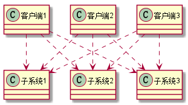
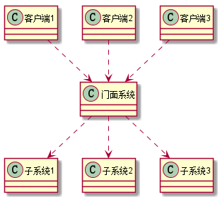
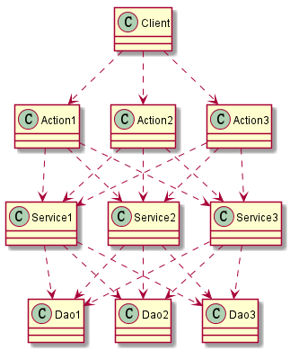
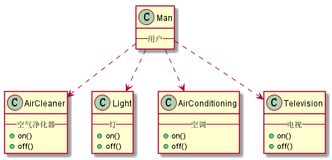

# 9. 设计模式之外观模式.md

> - 本人昵称: 天之妖星(kco1989/tianshi_kco)
> - 联系邮箱: <kco1989@qq.com>
> - 本文为博主原创文章，未经博主允许不得转载。如需转载,请标明博文原地址.
> - 代码已经全部托管[github](https://github.com/kco1989/examples)有需要的同学自行下载
> - 本人的博客地址如下:
>   - [CSDN](http://blog.csdn.net/tianshi_kco)
>   - [segmentfaul](https://segmentfault.com/u/kco1989)
>   - [博客园](http://www.cnblogs.com/k大co1989/)
>   - [开源中国](https://my.oschina.net/kco1989/blog)
>

# 引言
现在比如客户端要去操作一个功能,而这个功能可能涉及好几个系统,那么在没有引入外观模式之前是这样的



再来看一下,如果引入外观模式后的uml图



第二个方法就比第一方法简单多了,客户端只需跟门面系统进行对接,而不必关心子系统的实现,把客户端和多个子系统进行了有效的解耦.

# javaee 的三层架构
在开发过javaee web的同学应该很清楚,一般后台会分成三层架构,即:
- Action(Controller) 请求逻辑层
- Service 业务服务层
- Dao 数据访问层
其实这个就是三层除了对每层明确相应的职能,其中也包含了外观模式的思想在里面.



> 有些同学看到这个可能有点晕, 明明那么复杂,为什么是外观模式呢?
> 其实这个分开看, 
> - 对于`Client - Action - Service`, 那么 `Action`就是充当`门面系统`
> - 对于`Action - Service - Dao`, 那么 `Service`就是充当`门面系统`

# 智能家居控制系统
现在这生活都在鼓吹互联网+生活.智能家居也慢慢步入我们的生活.
在没有智能家居之前,我们在离开家时.我们要检查空调是否关了,电灯是否关了等等等等,所有设备都要检查一下.
可能有不少朋友跟我一样吧,明明已经走到半路,突然想起刚刚自己到底关灯没关灯.水龙头刚刚是关了没.甚至可能还要跑回家再确认一下.
现在好了,有了智能家具,一切变的方便了,我们只要拿起手机,然后点击`离家`,那么系统就会自动把这些设备给关闭了.我们都也不能去瞎担心.

没有智能家具之前:


有只能家具之后: 


## 智能家具设备
* 空调
```java
public class AirConditioning {
    public void on(){
        System.out.println("开空调....");
    }

    public void off(){
        System.out.println("关空调....");
    }
}
```
* 空气净化器
```java
public class AirCleaner {
    public void on(){
        System.out.println("开空气净化器....");
    }

    public void off(){
        System.out.println("关空气净化器....");
    }
}
```
* 电视
```java
public class Television {
    public void on(){
        System.out.println("开电视....");
    }

    public void off(){
        System.out.println("关电视....");
    }
}

```
* 灯
```java
public class Light {

    public void on(){
        System.out.println("开灯....");
    }

    public void off(){
        System.out.println("关灯....");
    }
}
```

## 总控
手机
```java
public class Television {
    public void on(){
        System.out.println("开电视....");
    }

    public void off(){
        System.out.println("关电视....");
    }
}
```

## 用户
```java
public class Man {
    public static void main(String[] args) {
        MobilePhone mobilePhone = new MobilePhone();
        System.out.println("上班了....");
        mobilePhone.leaveHome();
        System.out.println("===============");
        System.out.println("下班回家了.....");
        mobilePhone.goHome();
    }
}
```

> - 运行结果:
> - 上班了....
> - 关空气净化器....
> - 关空调....
> - 关灯....
> - 关电视....
> - ===============
> - 下班回家了.....
> - 开空气净化器....
> - 开空调....
> - 开灯....
> - 开电视....

# 打赏
>如果觉得我的文章写的还过得去的话,有钱就捧个钱场,没钱给我捧个人场(帮我点赞或推荐一下)
>
>
>
