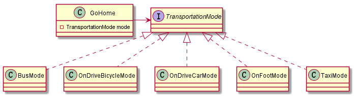

# 14. 设计模式之策略模式.md

> - 本人昵称: 天之妖星(kco1989/tianshi_kco)
> - 联系邮箱: <kco1989@qq.com>
> - 本文为博主原创文章，未经博主允许不得转载。如需转载,请标明博文原地址.
> - 代码已经全部托管[github](https://github.com/kco1989/examples)有需要的同学自行下载
> - 本人的博客地址如下:
>   - [CSDN](http://blog.csdn.net/tianshi_kco)
>   - [segmentfaul](https://segmentfault.com/u/kco1989)
>   - [博客园](http://www.cnblogs.com/k大co1989/)
>   - [开源中国](https://my.oschina.net/kco1989/blog)
>

# 引言
策略模式定义了一系列的算法，并将每一个算法封装起来，而且使它们还可以相互替换。策略模式让算法独立于使用它的客户而独立变化。

涉及角色:
- 环境类: 指的是某个场景,该类维护一个抽象策略类的引用
- 抽象策略: 为所有的具体策略提供统一的接口
- 具体策略: 真正的算法或逻辑实现类.


# 上下班例子
比如我们每天来回上下班,有的人可能选择步行,有的选择骑单车,或者做公交.


## 环境类: 回家 `GoHome`

```java
package com.kco.pattern.strategy.demo1;

/**
 * Created by Administrator on 2017/6/13.
 */
public class GoHome {
    private TransportationMode mode;
    private static TransportationMode defaultMode = new BusMode();
    public TransportationMode getMode() {
        return mode;
    }

    public void setMode(TransportationMode mode) {
        this.mode = mode;
    }

    public void goHome(){
        System.out.println("从公司出发...");
        if (mode == null){
            mode = defaultMode;
        }
        mode.run();
        System.out.println("回到家了....");
    }
}

```

## 抽象策略类: 交通方式  `TransportationMode`

```java
package com.kco.pattern.strategy.demo1;

/**
 * Created by Administrator on 2017/6/13.
 */
public interface TransportationMode {
    void run();
}

```

##具体策略: 各种交通方式

```java
public class BusMode implements TransportationMode {
    @Override
    public void run() {
        System.out.println("通过坐公交车....");
    }
}

public class OnDriveBicycleMode implements TransportationMode {
    @Override
    public void run() {
        System.out.println("通过骑单车......");
    }
}

public class OnDriveCarMode implements TransportationMode {
    @Override
    public void run() {
        System.out.println("通过开车....");
    }
}

public class OnFootMode implements TransportationMode {
    @Override
    public void run() {
        System.out.println("通过走路....");
    }
}

public class TaxiMode implements TransportationMode {
    @Override
    public void run() {
        System.out.println("通过打的.....");
    }
}

```

## 测试类:
```java
public class TestMain {
    public static void main(String[] args) {
        GoHome goHome = new GoHome();

        goHome.goHome();
        System.out.println("=================");

        goHome.setMode(new OnFootMode());
        goHome.goHome();
        System.out.println("=================");

        goHome.setMode(new TaxiMode());
        goHome.goHome();
        System.out.println("=================");

        goHome.setMode(new OnDriveBicycleMode());
        goHome.goHome();
        System.out.println("=================");

        goHome.setMode(new OnDriveCarMode());
        goHome.goHome();
        System.out.println("=================");
    }
}
```

运行结果:
```
从公司出发...
通过做公交车....
回到家了....
=================
从公司出发...
通过走路....
回到家了....
=================
从公司出发...
通过打的.....
回到家了....
=================
从公司出发...
通过骑单车......
回到家了....
=================
从公司出发...
通过开车....
回到家了....
=================
```

# 打赏
>如果觉得我的文章写的还过得去的话,有钱就捧个钱场,没钱给我捧个人场(帮我点赞或推荐一下)
>
>
>
