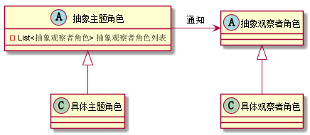
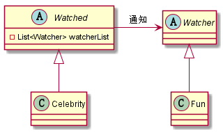

# 16. 设计模式之观察者模式.md

> - 本人昵称: 天之妖星(kco1989/tianshi_kco)
> - 联系邮箱: <kco1989@qq.com>
> - 本文为博主原创文章，未经博主允许不得转载。如需转载,请标明博文原地址.
> - 代码已经全部托管[github](https://github.com/kco1989/examples)有需要的同学自行下载
> - 本人的博客地址如下:
>   - [CSDN](http://blog.csdn.net/tianshi_kco)
>   - [segmentfaul](https://segmentfault.com/u/kco1989)
>   - [博客园](http://www.cnblogs.com/k大co1989/)
>   - [开源中国](https://my.oschina.net/kco1989/blog)
>

# 引言
观察者模式,有时又称为`发布-订阅`模式.就好比,有很多粉丝去关注明星的微博动态.当明星的微博更新了,那么那些粉丝就能收到相应的更新说明.



## 追星模式


### 抽象观察者 `Watcher`
```java
public interface Watcher {
    void update(String message);
}
```
### 抽象主题,被观察者 `Watched`

```java
public interface Watched {
    Watched add(Watcher w);
    Watched delete(Watcher w);
    void notifyWatcher(String message);
}
```

### 具体主题 明星 `Celebrity`

```java
public class Celebrity implements Watched{
    private String name;
    private List<Watcher> watcherList;
    public Celebrity(String name) {
        this.name = name;
        watcherList = new ArrayList<>();
    }

    @Override
    public Watched add(Watcher w) {
        if (w != null && !watcherList.contains(w)){
            watcherList.add(w);
        }
        return this;
    }

    @Override
    public Watched delete(Watcher w) {
        if (w != null){
            watcherList.remove(w);
        }
        return this;
    }

    @Override
    public void notifyWatcher(String message) {
        for (Watcher w : watcherList){
            w.update(name + " " + message);
        }
    }
}

```

### 具体观察者: 粉丝 `Follower`
```java
public class Follower implements Watcher{
    private String name;

    public Follower(String name) {
        this.name = name;
    }

    @Override
    public void update(String message) {
        System.out.println(name + " 观察到 " + message);
    }
}
```

### 测试类

```java
public class TestMain {
    public static void main(String[] args) {
        Celebrity xingYe = new Celebrity("周星驰");
        Celebrity huaZai = new Celebrity("刘德华");

        for (int i = 0; i < 3; i ++){
            Follower fun = new Follower("粉丝" + i);
            xingYe.add(fun);
        }

        for (int i = 3; i < 6; i ++){
            Follower fun = new Follower("粉丝" + i);
            xingYe.add(fun);
            huaZai.add(fun);
        }

        for (int i = 6; i < 9; i ++){
            Follower fun = new Follower("粉丝" + i);
            huaZai.add(fun);
        }

        xingYe.notifyWatcher("出新的电影了");
        huaZai.notifyWatcher("在深圳开演唱会了.");
    }
}

```

运行结果:

```
粉丝0 观察到 周星驰 出新的电影了
粉丝1 观察到 周星驰 出新的电影了
粉丝2 观察到 周星驰 出新的电影了
粉丝3 观察到 周星驰 出新的电影了
粉丝4 观察到 周星驰 出新的电影了
粉丝5 观察到 周星驰 出新的电影了
粉丝3 观察到 刘德华 在深圳开演唱会了.
粉丝4 观察到 刘德华 在深圳开演唱会了.
粉丝5 观察到 刘德华 在深圳开演唱会了.
粉丝6 观察到 刘德华 在深圳开演唱会了.
粉丝7 观察到 刘德华 在深圳开演唱会了.
粉丝8 观察到 刘德华 在深圳开演唱会了.
```

# 打赏
>如果觉得我的文章写的还过得去的话,有钱就捧个钱场,没钱给我捧个人场(帮我点赞或推荐一下)
>
>
>
