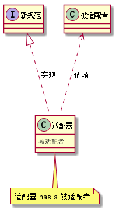

# 10. 设计模式之适配器模式.md

> - 本人昵称: 天之妖星(kco1989/tianshi_kco)
> - 联系邮箱: <kco1989@qq.com>
> - 本文为博主原创文章，未经博主允许不得转载。如需转载,请标明博文原地址.
> - 代码已经全部托管[github](https://github.com/kco1989/examples)有需要的同学自行下载
> - 本人的博客地址如下:
>   - [CSDN](http://blog.csdn.net/tianshi_kco)
>   - [segmentfaul](https://segmentfault.com/u/kco1989)
>   - [博客园](http://www.cnblogs.com/k大co1989/)
>   - [开源中国](https://my.oschina.net/kco1989/blog)
>

# 引言
适配器模式一般用于新老系统对接,或者不同的两个系统对接.
比如说两个系统各自使用了自己的接口规范.但有一天他们要对接.
在不修改原有代码的基础,增加一个类去适配两边的规范,这就是适配器模式.

适配器模式一般有两个情况
- 类适配器模式: 采用继承的方式适配原有的类 <br>

- 对象适配器模式: 采用组合依赖的方式适配又有的类 <br>


> 区别
> - 类适配器模式 适配者是 is a 被适配者的关系
> - 对象适配器模式 适配者是 has a 被适配者的关系

## 转接口
不知道有没有人体验过双屏显示器.对于程序员的我来说.我是比较喜欢双屏操作.
一个屏幕用来查资料,一个屏幕用来开发代码.感觉就是爽,但是现在买的显示器一般都是九针串口.
而我用的是笔记本, 刚好我的笔记本已经没有九针串口了.这是怎么办.难道就不要双屏显示了.
知道的朋友肯定肯定知道,卖个九针串口装USB的的转接口就搞定了.

### 笔记本接口 `Notebook`
笔记本只能使用USB接口,没有串口
```java
public interface Notebook {
    void usb();
}
```
### 显示器 `DisplayDevice`
显示器只有串口,没有usb接口

### 类适配器模式 `DisplayAdapter2`
```java
public class DisplayAdapter2 extends DisplayDevice implements Notebook{
    @Override
    public void usb() {
        serialPort();
    }
}
```

### 对象适配器模式`DisplayAdapter1`
```java
public class DisplayAdapter1 implements Notebook{
    private DisplayDevice displayDevice;

    public DisplayAdapter1(DisplayDevice displayDevice) {
        this.displayDevice = displayDevice;
    }
    @Override
    public void usb() {
        displayDevice.serialPort();
    }
}
```

### 测试程序

```java
public class TestMain {

    public static void main(String[] args) {
        DisplayDevice displayDevice = new DisplayDevice();
        Notebook notebook1 = new DisplayAdapter1(displayDevice);
        notebook1.usb();

        System.out.println("=======================");

        Notebook notebook2 = new DisplayAdapter2();
        notebook2.usb();
    }
}
```

> - 运行结果
> - 显示器可以正常工作了.
> - =======================
> - 显示器可以正常工作了.

ok, 完美适配...
# 打赏
>如果觉得我的文章写的还过得去的话,有钱就捧个钱场,没钱给我捧个人场(帮我点赞或推荐一下)
>
>
>
