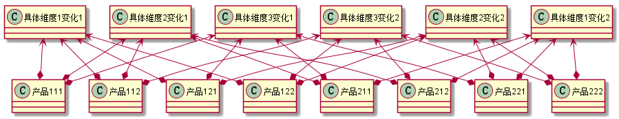
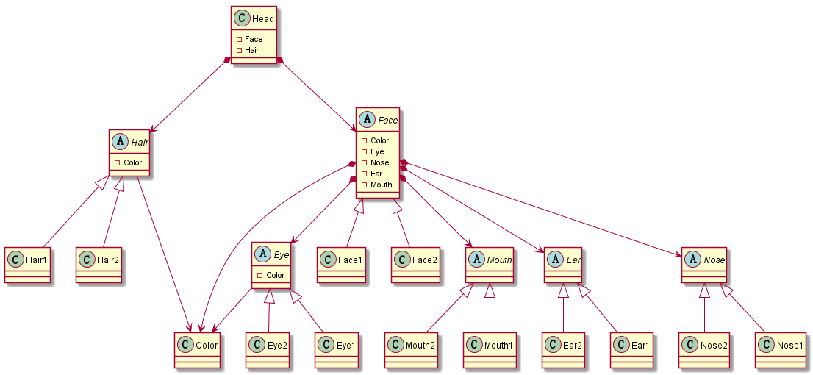

# 11. 设计模式之代理模式.md

> - 本人昵称: 天之妖星(kco1989/tianshi_kco)
> - 联系邮箱: <kco1989@qq.com>
> - 本文为博主原创文章，未经博主允许不得转载。如需转载,请标明博文原地址.
> - 代码已经全部托管[github](https://github.com/kco1989/examples)有需要的同学自行下载
> - 本人的博客地址如下:
>   - [CSDN](http://blog.csdn.net/tianshi_kco)
>   - [segmentfaul](https://segmentfault.com/u/kco1989)
>   - [博客园](http://www.cnblogs.com/k大co1989/)
>   - [开源中国](https://my.oschina.net/kco1989/blog)
>

# 引言
在软件系统中，某些类型由于自身的逻辑，它具有两个或多个维度的变化，那么如何应对这种“多维度的变化”？
如何利用面向对象的技术来使得该类型能够轻松的沿着多个方向进行变化，而又不引入额外的复杂度？这就要使用桥接模式。


如果不用桥接模式,那么就变成了



看到没总共就生成了`2*2*2=8`种产品.如果其中一个`具体维度`又增加一种变化,那么就变成`2*3*2=12`,也就是说一些要增加4个具体产品类.
想一想都要疯掉了.

# 游戏中创建角色
相信很多人都玩过rpg游戏吧,在游戏刚开始的时候,需要用户自行创建一个角色.可以自定制各种头发,表情等等.
想看一下总体的的uml图,让各位看官感受一下其中的复杂性.



我现在对于头部`Head`中的`Face`,`Hair`,`Eye`,`Ear`,`Nose`,`Mouth`也仅仅只做两种变化.这就可以合成几十张不同的脸了.
在游戏中,也每个器官的变化也不仅仅只有两种,如果不适用桥接模式,那么后台到底要生成多少钟不同的脸??

## 头部 `Head`
头部包含头发`Hair`和脸部`Face`

```java
public class Head {
    private Hair hair;
    private Face face;

    public Head(Hair hair, Face face) {
        this.hair = hair;
        this.face = face;
    }

    @Override
    public String toString() {
        return "角色拥有: " + hair + " 和 " + face;
    }
}
```

## 头发 `Hair`
头发包含颜色,和各种不同的发型

```java
public abstract class Hair {
    protected Color color;
    public abstract String name();

    public Hair(Color color) {
        this.color = color;
    }

    @Override
    public String toString() {
        return color + "的" + name();
    }
}
```
- 变化1

```java
public class Face1 extends Face {
    public Face1(Color color, Eye eye, Nose nose, Mouth mouth, Ear ear) {
        super(color, eye, nose, mouth, ear);
    }

    @Override
    public String name() {
        return "笑脸";
    }
}
```

- 变化2

```java
public class Face1 extends Face {
    public Face1(Color color, Eye eye, Nose nose, Mouth mouth, Ear ear) {
        super(color, eye, nose, mouth, ear);
    }

    @Override
    public String name() {
        return "哭丧脸";
    }
}
```

## 脸部  `Face`
脸部包含眼睛,鼻子,耳朵和嘴巴,本身脸部也有笑脸,哭脸的多种变化.

```java
public abstract class Face {
    protected Color color;
    protected Eye eye;
    protected Nose nose;
    protected Mouth mouth;
    protected Ear ear;
    public abstract String name();

    public Face(Color color, Eye eye, Nose nose, Mouth mouth, Ear ear) {
        this.color = color;
        this.eye = eye;
        this.nose = nose;
        this.mouth = mouth;
        this.ear = ear;
    }

    @Override
    public String toString() {
        return color + "的" + name() + ", 眼睛: " + eye + ", 鼻子: " + nose + ", 嘴巴:" + mouth + ",耳朵: " + ear;
    }
}
```

- 变化1
```java
public class Face1 extends Face {
    public Face1(Color color, Eye eye, Nose nose, Mouth mouth, Ear ear) {
        super(color, eye, nose, mouth, ear);
    }

    @Override
    public String name() {
        return "笑脸";
    }
}
```
- 变化2
```java
public class Face1 extends Face {
    public Face1(Color color, Eye eye, Nose nose, Mouth mouth, Ear ear) {
        super(color, eye, nose, mouth, ear);
    }

    @Override
    public String name() {
        return "哭丧脸";
    }
}
```

## 眼睛 `Eye'
眼睛有包括眼珠的颜色,和各种眼形
```java
public abstract class Eye {
    protected Color color;
    public abstract String name();

    public Eye(Color color) {
        this.color = color;
    }

    @Override
    public String toString() {
        return name() + ",拥有 " + color + "的眼珠" ;
    }
}
```
- 变化1
```java
public class Eye1 extends Eye {

    @Override
    public String name() {
        return "杏眼";
    }

    public Eye1(Color color) {
        super(color);
    }

}
```
- 变化2
```java
public class Eye1 extends Eye {

    @Override
    public String name() {
        return "丹凤眼";
    }

    public Eye1(Color color) {
        super(color);
    }

}
```

## 鼻子 `Nose`
鼻子有各种各样的形状

> 类似眼睛`Eye`,这里就不贴代码了
## 耳朵 `Ear`
耳朵也有各种各样的形状
> 类似眼睛`Eye`,这里就不贴代码了
## 嘴巴 `Mouth`
嘴巴也有各种各样的形状
> 类似眼睛`Eye`,这里就不贴代码了

## 测试类
```java
public class TestMain {
    public static void main(String[] args) {
        Head head1 = new Head(new Hair1(Color.Black),
                new Face1(Color.White,
                        new Eye1(Color.Black),
                        new Nose1(),
                        new Mouth1(),
                        new Ear2()));
        System.out.println(head1);

        Head head2 = new Head(new Hair2(Color.Yello),
                new Face2(Color.Blue,
                        new Eye2(Color.White),
                        new Nose2(),
                        new Mouth2(),
                        new Ear1()));
        System.out.println(head2);
    }
}
```

> - 运行结果:
> - 角色拥有: 黑色的卷发 和 白色的笑脸, 眼睛: 杏眼,拥有 黑色的眼珠, 鼻子: 龙鼻, 嘴巴:大嘴巴,耳朵: 猪耳
> - 角色拥有: 黄色的长发 和 蓝色的哭丧脸, 眼睛: 丹凤眼,拥有 白色的眼珠, 鼻子: 狮鼻, 嘴巴:樱桃小嘴,耳朵: 橘子耳朵

这样我们是不是很好的创建出不同的脸形

# 后记
在这个例子中,其实我们可能配合享元模式一起使用.因为每个器官的每种变化都是固定了.
如果每个用户都new出一个来.那么也会造成内存浪费.这里我不想把代码弄的太复杂,所以没有使用享元模式.
因此,在实际生产中,我们一般不是仅仅使用一种设计模式,而且多个模式混合使用.


# 打赏
>如果觉得我的文章写的还过得去的话,有钱就捧个钱场,没钱给我捧个人场(帮我点赞或推荐一下)
>
>
>
