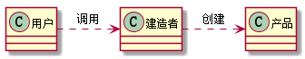

# 5. 设计模式之建造者模式.md

> - 本人昵称: 天之妖星(kco1989/tianshi_kco)
> - 联系邮箱: <kco1989@qq.com>
> - 本文为博主原创文章，未经博主允许不得转载。如需转载,请标明博文原地址.
> - 代码已经全部托管[github](https://github.com/kco1989/examples)有需要的同学自行下载
> - 本人的博客地址如下:
>   - [CSDN](http://blog.csdn.net/tianshi_kco)
>   - [segmentfaul](https://segmentfault.com/u/kco1989)
>   - [博客园](http://www.cnblogs.com/k大co1989/)
>   - [开源中国](https://my.oschina.net/kco1989/blog)
>

# 引言
先看一下`建造者模式`的uml图 <br>

从uml图中,我们发现`建造者模式`和`工厂模式`比较接近.都是用来创建对象的.
那么两者的区别是什么呢?怎么说吧,如果要创建复杂的对象,那么就用`工厂模式`,如果要创建更加复杂的对象就用`建造者模式`
- `工厂模式`一般适用于创建一个整体的产品,即无法定制化
- `建造者模式`则是可能定制化创建一个产品.

比如我们如果去深圳华强北买电脑,要么你可以直接选择某一个型号,下单买走.那么这就是`工厂模式`.
也就是说你选择好的型号,那么该电脑的配置一般在出厂的时候就已经固定了.
但是有一些高级玩家,可能不满足官方的给出的固定配置,这个时候就会自行组装电脑.这就是`建造者模式`.
根据自身的要求,定制化自己需要的硬件,组装成自己想要的电脑.

# 例子


## 电脑

```java
public class Computer {
    private String cpu;
    private String memory;
    private String graphicsCard;
    private String type;
    private String screen;
    private String operatingSystem;

    public String getCpu() {
        return cpu;
    }

    public void setCpu(String cpu) {
        this.cpu = cpu;
    }

    public String getMemory() {
        return memory;
    }

    public void setMemory(String memory) {
        this.memory = memory;
    }

    public String getGraphicsCard() {
        return graphicsCard;
    }

    public void setGraphicsCard(String graphicsCard) {
        this.graphicsCard = graphicsCard;
    }

    public String getType() {
        return type;
    }

    public void setType(String type) {
        this.type = type;
    }

    public String getScreen() {
        return screen;
    }

    public void setScreen(String screen) {
        this.screen = screen;
    }

    public String getOperatingSystem() {
        return operatingSystem;
    }

    public void setOperatingSystem(String operatingSystem) {
        this.operatingSystem = operatingSystem;
    }

    @Override
    public String toString() {
        return "电脑配置{" +
                "CPU='" + cpu + '\'' +
                ", 内存='" + memory + '\'' +
                ", 显卡='" + graphicsCard + '\'' +
                ", 类型='" + type + '\'' +
                ", 显示器='" + screen + '\'' +
                ", 操作系统='" + operatingSystem + '\'' +
                '}';
    }
}
```

## 电脑建造者

```java
public class ComputerBuild {
    private String cpu;
    private String memory;
    private String graphicsCard;
    private String type;
    private String screen;
    private String operatingSystem;

    public String cpu() {
        return cpu;
    }

    public ComputerBuild cpu(String cpu) {
        this.cpu = cpu;
        return this;
    }

    public String memory() {
        return memory;
    }

    public ComputerBuild memory(String memory) {
        this.memory = memory;
        return this;
    }

    public String graphicsCard() {
        return graphicsCard;
    }

    public ComputerBuild graphicsCard(String graphicsCard) {
        this.graphicsCard = graphicsCard;
        return this;
    }

    public String type() {
        return type;
    }

    public ComputerBuild type(String type) {
        this.type = type;
        return this;
    }

    public String screen() {
        return screen;
    }

    public ComputerBuild screen(String screen) {
        this.screen = screen;
        return this;
    }

    public String operatingSystem() {
        return operatingSystem;
    }

    public ComputerBuild operatingSystem(String operatingSystem) {
        this.operatingSystem = operatingSystem;
        return this;
    }

    public Computer build(){
        Computer computer = new Computer();
        if (cpu() != null){
            computer.setCpu(cpu());
        }
        if (memory() != null){
            computer.setMemory(memory());
        }
        if (graphicsCard() != null){
            computer.setGraphicsCard(graphicsCard());
        }
        if (type() != null){
            computer.setType(type());
        }
        if (screen() != null){
            computer.setScreen(screen());
        }
        if (operatingSystem() != null){
            computer.setOperatingSystem(operatingSystem());
        }
        return computer;
    }
}
```

## 测试

```java
public class TestMain {

    public static void main(String[] args) {
        ComputerBuild b = new ComputerBuild();
        Computer computerA = b.operatingSystem("window 系统")
                .graphicsCard("发烧友显卡")
                .memory("16G 内存")
                .cpu("奔腾I7")
                .type("游戏本")
                .build();
        Computer computerB = b.operatingSystem("linux 系统")
                .graphicsCard("入门级显卡")
                .memory("8G 内存")
                .cpu("奔腾I5")
                .type("上网本")
                .build();
        System.out.println(computerA);
        System.out.println(computerB);
    }
}
```

> 运行结果:<br/>
> 电脑配置{CPU='奔腾I7', 内存='16G 内存', 显卡='发烧友显卡', 类型='游戏本', 显示器='null', 操作系统='window 系统'}<br/>
> 电脑配置{CPU='奔腾I5', 内存='8G 内存', 显卡='入门级显卡', 类型='上网本', 显示器='null', 操作系统='linux 系统'}<br/>

# 打赏
>如果觉得我的文章写的还过得去的话,有钱就捧个钱场,没钱给我捧个人场(帮我点赞或推荐一下)
>
>
>
