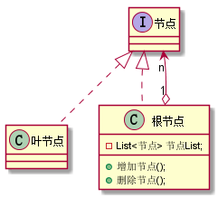

# 13. 设计模式之组合模式.md

> - 本人昵称: 天之妖星(kco1989/tianshi_kco)
> - 联系邮箱: <kco1989@qq.com>
> - 本文为博主原创文章，未经博主允许不得转载。如需转载,请标明博文原地址.
> - 代码已经全部托管[github](https://github.com/kco1989/examples)有需要的同学自行下载
> - 本人的博客地址如下:
>   - [CSDN](http://blog.csdn.net/tianshi_kco)
>   - [segmentfaul](https://segmentfault.com/u/kco1989)
>   - [博客园](http://www.cnblogs.com/k大co1989/)
>   - [开源中国](https://my.oschina.net/kco1989/blog)
>

# 引言
组合模式，将对象组合成树形结构以表示“部分-整体”的层次结构，
组合模式使得用户对单个对象和组合对象的使用具有一致性。
掌握组合模式的重点是要理解清楚 “部分/整体” 还有 ”单个对象“ 与 "组合对象" 的含义。

涉及的角色:
- 抽象节点:Component 是组合中的对象声明接口，在适当的情况下，实现所有类共有接口的默认行为。声明一个接口用于访问和管理Component子部件。
- 叶子节点:Leaf 在组合中表示叶子结点对象，叶子结点没有子结点。
- 枝节点:Composite 定义有枝节点行为，用来存储子部件，在Component接口中实现与子部件有关操作，如增加(add)和删除(remove)等。



换重说法,组合模式表现起来就是树形模式.
- html的dom标签, 比如想div,p,span的标签这些就是枝节点,它们可以包含其他标签在内,但是如img,input,button这也就是叶子节点,本身已经不能在包含其他标签了
- 代理商和商户. 代理商可以包含下级代理商和商户,但是商户独立的.那么代理商就是枝节点,商户就是叶子节点
- 文件和文件夹, 文件夹可以包含文件和文件夹,但是文件本身就是独立的.那么文件夹就是枝节点,文件就是叶子节点
- ....

> 组合模式的例子在生活中是比比皆是的,这里,我们就随便举个例子说明一下把

# 网游中组队
相信很多人都玩过网游把.一般网游都是可以组队,在队伍中又可能分配分队长,分队长又可以继续组队.
> 暂时不考虑组队人数的限制
>> 最近看<<全职高手>>,里面的网游*荣耀*在刷圣诞任务的时候,就组了100个人的大队.


## 抽象角色 - 游戏橘色 `GameOver`
在网游组队中,不管是队长或者成员,都是一个游戏角色

```java
public abstract class GameRole {
    protected String name;

    public GameRole(String name) {
        this.name = name;
    }

    public String getName() {
        return name;
    }

    public void setName(String name) {
        this.name = name;
    }

}
```

## 枝节点 - 队长 `Leader`
队长拥有加人和踢人的权限

```java
public class Leader extends GameRole{

    List<GameRole> gameRoles;

    public Leader(String name) {
        super(name);
    }

    public void add(GameRole role){
        if (gameRoles == null){
            gameRoles = new ArrayList<>();
        }
        gameRoles.add(role);
    }

    public void remove(GameRole role){
        if (gameRoles == null){
            return;
        }
        gameRoles.remove(role);
    }

    public boolean contains(GameRole role){
        if (gameRoles == null){
            return false;
        }
        return gameRoles.contains(role);
    }
    public void display(){
        System.out.println("总队长: " + this.name);
        display(1, this.gameRoles);
    }

    private void display(int index, List<GameRole> gameRoles) {
        if (gameRoles == null){
            return;
        }
        String leftPad = StringUtils.leftPad("", index, "\t");
        for (GameRole  role : gameRoles){
            String prefix = role instanceof Leader ? "分队长:" : "成员:";
            System.out.println(leftPad + prefix + role.getName());
            if (role instanceof Leader){
                display(index + 1, ((Leader) role).gameRoles);
            }
        }
    }
}
```

## 叶子节点 成员 `Member`
成员没啥特权

```java
public class Member extends GameRole{
    public Member(String name) {
        super(name);
    }
}
```

## 模拟组队

```java
public class TestMain {
    public static void main(String[] args) {
        Leader junMoXiao = new Leader("君莫笑");
        junMoXiao.add(new Member("寒烟柔"));
        junMoXiao.add(new Member("风梳烟沐"));
        String[] leaders = {
                "蓝河","车前子","孤饮"
        };
        Random r = new Random();
        for (String leaderName : leaders){
            Leader leader = new Leader(leaderName);
            for (int i = 0; i < r.nextInt(3) + 2; i ++){
                leader.add(new Member(leaderName + "的成员 " + i + "号"));
            }
            junMoXiao.add(leader);
        }
        junMoXiao.display();
    }
}
```

运行结果:
```
总队长: 君莫笑
	成员:寒烟柔
	成员:风梳烟沐
	分队长:蓝河
		成员:蓝河的成员 0号
		成员:蓝河的成员 1号
	分队长:车前子
		成员:车前子的成员 0号
		成员:车前子的成员 1号
		成员:车前子的成员 2号
	分队长:孤饮
		成员:孤饮的成员 0号
		成员:孤饮的成员 1号
		成员:孤饮的成员 2号
		成员:孤饮的成员 3号
```

# 打赏
>如果觉得我的文章写的还过得去的话,有钱就捧个钱场,没钱给我捧个人场(帮我点赞或推荐一下)
>
>
>
