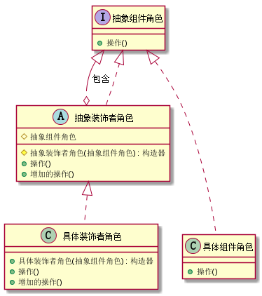
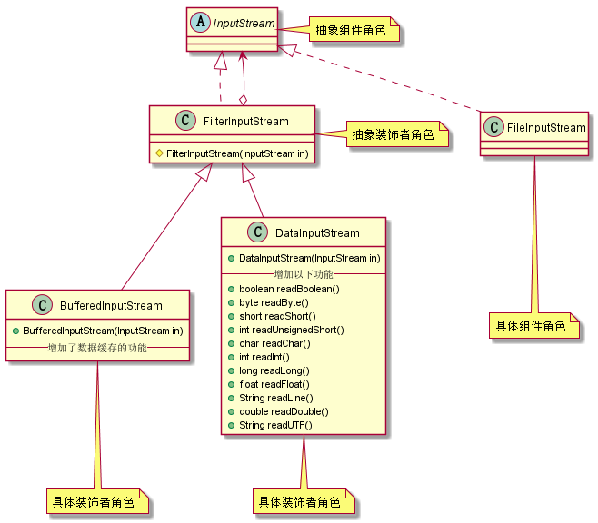
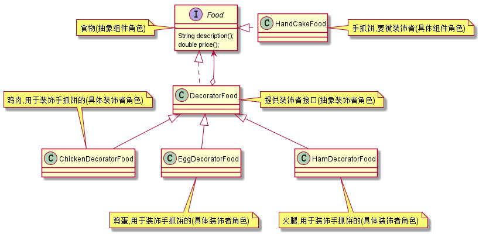

# 5. 设计模式之建造者模式.md

> - 本人昵称: 天之妖星(kco1989/tianshi_kco)
> - 联系邮箱: <kco1989@qq.com>
> - 本文为博主原创文章，未经博主允许不得转载。如需转载,请标明博文原地址.
> - 代码已经全部托管[github](https://github.com/kco1989/examples)有需要的同学自行下载
> - 本人的博客地址如下:
>   - [CSDN](http://blog.csdn.net/tianshi_kco)
>   - [segmentfaul](https://segmentfault.com/u/kco1989)
>   - [博客园](http://www.cnblogs.com/k大co1989/)
>   - [开源中国](https://my.oschina.net/kco1989/blog)
>

# 引言
装饰者模式定义:在不必改变原类文件和使用继承的情况下，动态地扩展一个对象的功能。
它是通过创建一个包装对象，也就是装饰来包裹真实的对象。点击[这里](http://baike.baidu.com/link?url=_G5-AP08ylUx6UPgN7aX9zijndnJWjXaklj_BOnm7SxP8qDr6Az9GYb8bCau84FMa0Sgew5vda1AW75OKiq_0cJL3fgk485YjEorYLzMkn_mJ5Vzto26cRnJW-za7pZi)查看更多.

我们先看一下装饰者的uml模型 <br/>

其中包括以下集中角色:
- 抽象组件角色 : 为组件提供规范的接口
- 具体组件角色 : 需要被装饰的组件角色
- 抽象装饰者角色: 为通用的装饰者提供接口,可以增加新的功能
- 具体装饰者角色: 真正的装饰者对象

# java的io流
可能各位看官看了上面的解释还是很迷茫,这里我们先举java自带io流做例子.我这里仅仅列举部分io类.先看一下io流的uml图 <br>


- InputStream 抽象组件角色 -> 提供io字节流的读取规范
- FileInputStream 具体组件角色 -> 提供读取字节文件的具体操作
- FilterInputStream 抽象装饰者角色 -> 仅仅是为子类提供装饰者的接口
- BufferedInputStream 具体装饰者角色 -> 增加了数据缓存的功能
- DataInputStream 具体装饰者角色 -> 增加了读取字节,int,float,整行数据等等功能

如果现在我要读取一个字节文件,但是我需要缓存的功能,那么我们一般是这么写的:`BufferedInputStream ris = new BufferedInputStream(new FileInputStream(file))`

如果我现在要读取一个按照某种格式的字节文件,比如要读取整数,浮点数,或者整行数据,那么就应该这么写: `DataInputStream dis = new DataInputStream(new FileInputStream(file))`

那如果我要两者综合起来呢?既要缓存,也要能去读整数,浮点数,或者整行数据.那么就应该这样写: `DataInputStream dis = new DataInputStream(new BufferedInputStream(new FileInputStream(file)))`

也就是说我可能用`具体装饰者角色`重叠的去装饰`具体组件角色`,以达到我们想要额外增加的功能,而不需要去改变`具体组件角色`.

# 路边摊 -- 手抓饼
在深圳的路边经常有看到一小贩推着车买手抓饼的.
一般手抓饼5元,加鸡蛋要2元,加鸡肉要5元,加火腿要3元.
这个时候我们就可以使用装饰者模式要研究一下.
先看一下uml图: <br>


## 抽象组件角色 `Food`

```java
public interface Food {
    // 描述
    String description();
    // 价格
    double price();
}
```
## 具体组件角色  `HandCakeFood` 
手抓饼

```java
public class HandCakeFood implements Food {

    @Override
    public String description() {
        return "手抓饼";
    }

    @Override
    public double price() {
        return 5.0;
    }
}
```

## 抽象装饰者角色 `DecoratorFood`

```java
public class DecoratorFood implements Food{

    protected Food food;
    protected DecoratorFood(Food food){
        this.food = food;
    }
    @Override
    public String description() {
        return food.description();
    }

    @Override
    public double price() {
        return food.price();
    }
}
```

## 具体装饰者角色

鸡肉
```java
public class ChickenDecoratorFood extends DecoratorFood {

    protected ChickenDecoratorFood(Food food) {
        super(food);
    }

    @Override
    public String description() {
        return "加了鸡肉的" + food.description();
    }

    @Override
    public double price() {
        return food.price() + 5;
    }
}
```

鸡蛋
```java
public class EggDecoratorFood extends DecoratorFood {

    protected EggDecoratorFood(Food food) {
        super(food);
    }

    @Override
    public String description() {
        return "加了鸡蛋的" + food.description();
    }

    @Override
    public double price() {
        return food.price() + 2;
    }
}
```

火腿
```java
public class HamDecoratorFood extends DecoratorFood {

    protected HamDecoratorFood(Food food) {
        super(food);
    }

    @Override
    public String description() {
        return "加了火腿的" + food.description();
    }

    @Override
    public double price() {
        return food.price() + 3;
    }
}

```

## 测试类

```java
public class TestMain {
    public static void main(String[] args) {
        System.out.println("老板: 手抓饼 5元, 鸡蛋: 2元, 鸡肉 5元, 火腿 3元");

        System.out.println("顾客A: 老板要一份手抓饼: ");
        Food food1 = new HandCakeFood();
        System.out.println("老板: 好勒, 给你 \"" + food1.description() + "\", 一共 " + food1.price() + "元");

        System.out.println("顾客B: 老板要一份手抓饼, 加个蛋: ");
        Food food2 = new EggDecoratorFood(new HandCakeFood());
        System.out.println("老板: 好勒, 给你 \"" + food2.description() + "\", 一共 " + food2.price() + "元");

        System.out.println("顾客C: 老板要一份手抓饼, 加个蛋再加个鸡肉: ");
        Food food3 = new EggDecoratorFood(new ChickenDecoratorFood(new HandCakeFood()));
        System.out.println("老板: 好勒, 给你 \"" + food3.description() + "\", 一共 " + food3.price() + "元");

        System.out.println("顾客D: 老板要一份手抓饼, 所有的东西都加一遍: ");
        Food food4 = new HamDecoratorFood(new EggDecoratorFood(new ChickenDecoratorFood(new HandCakeFood())));
        System.out.println("老板: 好勒, 给你 \"" + food4.description() + "\", 一共 " + food4.price() + "元");

        System.out.println("顾客E: 老板要一份手抓饼, 要双蛋: ");
        Food food5 = new EggDecoratorFood(new EggDecoratorFood(new HandCakeFood()));
        System.out.println("老板: 好勒, 给你 \"" + food5.description() + "\", 一共 " + food5.price() + "元");
    }
}
```

> - 运行结果:
> - 老板: 手抓饼 5元, 鸡蛋: 2元, 鸡肉 5元, 火腿 3元
> - 顾客A: 老板要一份手抓饼: 
> - 老板: 好啦, 给你 "手抓饼", 一共 5.0元
> - 顾客B: 老板要一份手抓饼, 加个蛋: 
> - 老板: 好啦, 给你 "加了鸡蛋的手抓饼", 一共 7.0元
> - 顾客C: 老板要一份手抓饼, 加个蛋再加个鸡肉: 
> - 老板: 好啦, 给你 "加了鸡蛋的加了鸡肉的手抓饼", 一共 12.0元
> - 顾客D: 老板要一份手抓饼, 所有的东西都加一遍: 
> - 老板: 好啦, 给你 "加了火腿的加了鸡蛋的加了鸡肉的手抓饼", 一共 15.0元
> - 顾客E: 老板要一份手抓饼, 要双蛋: 
> - 老板: 好啦, 给你 "加了鸡蛋的加了鸡蛋的手抓饼", 一共 9.0元

## 小结
在不改变手抓饼的情况下,我们增加了手抓饼的多种选择.
如果这个时候要想要加辣椒的,那么我们就在不改变原有代码的情况,增加一个`辣椒装饰者`类就行了.


# 打赏
>如果觉得我的文章写的还过得去的话,有钱就捧个钱场,没钱给我捧个人场(帮我点赞或推荐一下)
>
>
>
