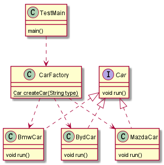
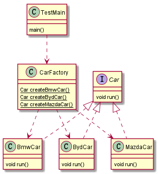
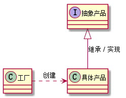

# 1. 设计模式之简单工厂模式.md

> - 本人昵称: 天之妖星(kco1989/tianshi_kco)
> - 联系邮箱: <kco1989@qq.com>
> - 本文为博主原创文章，未经博主允许不得转载。如需转载,请标明博文原地址.
> - 代码已经全部托管[github](https://github.com/kco1989/examples)有需要的同学自行下载
> - 本人的博客地址如下:
>   - [CSDN](http://blog.csdn.net/tianshi_kco)
>   - [segmentfaul](https://segmentfault.com/u/kco1989)
>   - [博客园](http://www.cnblogs.com/kco1989/)
>   - [开源中国](https://my.oschina.net/kco1989/blog)
>

# 引言

今天我准备讲一下工厂模式.工厂模式一般有三种:
1. 简单工厂(又称为静态工厂方法模式)
2. 工厂方法模式
3. 抽象工厂模式

# 简单工厂

先看一下简单工程的uml图 <br/>


## 工厂类 `CarFactory`
汽车工厂类`CarFactory`提供一个静态方法`createCar`,根据不同的参数创建不同的品牌的汽车.

```java
public class CarFactory {
    public static Car createCar(String type){
        switch (type.toUpperCase()){
            case "BMW":
                return new BmwCar();
            case "BYD":
                return new BydCar();
            case "MAZDA":
                return new MazdaCar();
            default:
                return null;
        }
    }
}
```

## 汽车接口类 `Car`

汽车接口类,主要为所有品牌的汽车抽象出共同具有的操作,比如驾驶汽车操作`run`
```java
public interface Car {
    void run();
}
```

## 品牌汽车`BmwCar` `BydCar` `MazdaCar`

`BmwCar` `BydCar` `MazdaCar`实现`Car`接口.并实现各自的驾驶操作`run`

```java
public class BmwCar implements Car {
    @Override
    public void run() {
        System.out.println("我是宝马,我在路上飞奔..");
    }
}
```

```java
public class BydCar implements Car {
    @Override
    public void run() {
        System.out.println("我是比亚迪,我在路上飞奔..");
    }
}
```

```java
public class MazdaCar implements Car {
    @Override
    public void run() {
        System.out.println("我是马自达,我在路上飞奔..");
    }
}
```

## 测试类
```java
public class TestMain {
    public static void main(String[] args) {
        Car bmw = CarFactory.createCar("BMW");
        Car byd = CarFactory.createCar("BYD");
        Car mazDa = CarFactory.createCar("MazDa");
        bmw.run();
        byd.run();
        mazDa.run();
    }
}
```

运行结果:

我是宝马,我在路上飞奔.. <br/>
我是比亚迪,我在路上飞奔..<br/>
我是马自达,我在路上飞奔..<br/>

## 小结
简单工厂模式还有另外一种表现形式,如:<br/>

- 第一种是通过一个静态方法,不同的参数创建出不同的产品,
- 第二中是通过不同的静态方法,创建出不同的产品

### 优点

都是比较简单,不用考虑产品是如何创建的,只需要直接消费工厂类创造的产品,就好比,玩具工厂在创建玩具的时候,我们不能去考虑玩具的具体制造过程,只需要通过玩具工厂,直接拿到已经创建的好的玩具.

### 缺点

简单工厂的缺点也比较明显,就是如果想增加新的产品,那么就不得不去修改工厂类.违反了设计模式的`开闭原则`.


> 最后给出一张简单的工厂一般uml图 <br/>
> 

# 打赏
>如果觉得我的文章写的还过得去的话,有钱就捧个钱场,没钱给我捧个人场(帮我点赞或推荐一下)
>
>
>
