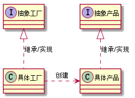
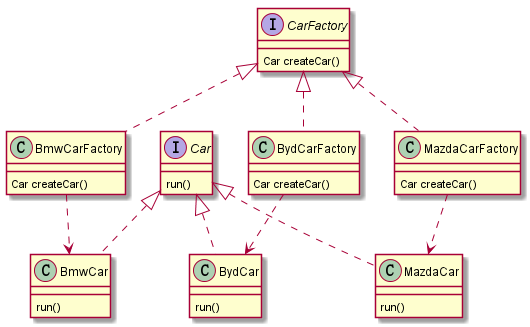

# 2. 设计模式之工厂方法模式.md

> - 本人昵称: 天之妖星(kco1989/tianshi_kco)
> - 联系邮箱: <kco1989@qq.com>
> - 本文为博主原创文章，未经博主允许不得转载。如需转载,请标明博文原地址.
> - 代码已经全部托管[github](https://github.com/kco1989/examples)有需要的同学自行下载
> - 本人的博客地址如下:
>   - [CSDN](http://blog.csdn.net/tianshi_kco)
>   - [segmentfaul](https://segmentfault.com/u/kco1989)
>   - [博客园](http://www.cnblogs.com/k大co1989/)
>   - [开源中国](https://my.oschina.net/kco1989/blog)
>

# 引言
在上一篇博文中讲到简单工厂模式,发现简单工厂模式有个致命的缺点.
就是在新增产品的时候,我们不得不修改工厂类,这就违反了设计模式的`开闭原则`.
因此今天我们讲解一种改进方法,那就是工厂方法模式.

# 工厂方法模式
我们先看一下工厂方法模式一般的uml图: <br/>


从图中我们可以看出来,每个具体产品都由一个具体工厂来制造,
也就是说以后每增加一个产品,我们就新开一家工厂.

## 例子
回头再看一下我们制造汽车的例子,先看一下uml图,总体先有个大致的印象:<br/>


### 抽象汽车工厂类 `CarFactory` 
`CarFactory`: 为每个具体工厂提供制造汽车的共同接口: `createCar`

```java
public interface CarFactory {
    Car createCar();
}
```

### 具体的汽车工厂类 `BmwCarFactory`,`BydCarFactory`,`MazdaCarFactory`

`BmwCarFactory`
```java
public class BmwCarFactory implements CarFactory {
    @Override
    public Car createCar() {
        return new BmwCar();
    }
}
```

`BydCarFactory`
```java
public class BydCarFactory implements CarFactory {
    @Override
    public Car createCar() {
        return new BydCar();
    }
}
```

`MazdaCarFactory`
```java
public class MazdaCarFactory implements CarFactory{
    @Override
    public Car createCar() {
        return new MazdaCar();
    }
}
```

### 抽象汽车类 `Car`

```java
public interface Car {
    void run();
}
```

### 具体汽车类 `BmwCar`, `BydCar`, `MazdaCar`

`BmwCar`
```java
public class BmwCar implements Car {
    @Override
    public void run() {
        System.out.println("我是宝马,我在路上飞奔..");
    }
}
```

`BydCar`
```java
public class BydCar implements Car {
    @Override
    public void run() {
        System.out.println("我是比亚迪,我在路上飞奔..");
    }
}
```

`MazdaCar`
```java
public class MazdaCar implements Car {
    @Override
    public void run() {
        System.out.println("我是马自达,我在路上飞奔..");
    }
}
```

### 测试类

```java
public class TestMain {
    public static void main(String[] args) {
        CarFactory bwmFactory = new BmwCarFactory();
        CarFactory bydFactory = new BydCarFactory();
        CarFactory mazdaFactory = new MazdaCarFactory();
        Car bwn = bwmFactory.createCar();
        Car byd = bydFactory.createCar();
        Car mazda = mazdaFactory.createCar();
        bwn.run();
        byd.run();
        mazda.run();
    }
}
```

> 运行结果:
> 我是宝马,我在路上飞奔.. <br/>
> 我是比亚迪,我在路上飞奔..<br/>
> 我是马自达,我在路上飞奔..<br/>


# 打赏
>如果觉得我的文章写的还过得去的话,有钱就捧个钱场,没钱给我捧个人场(帮我点赞或推荐一下)
>
>
>
