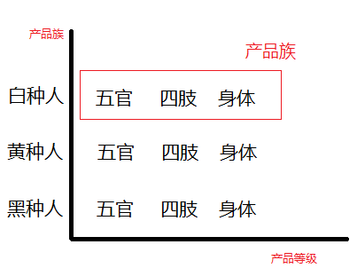
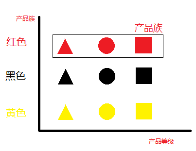
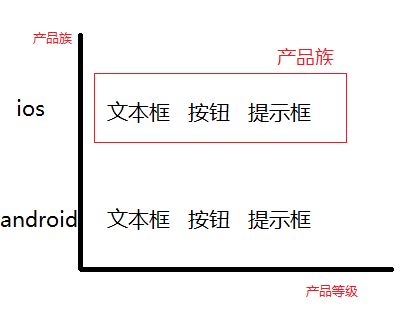
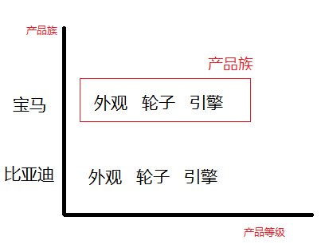
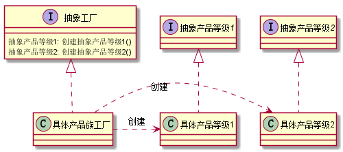
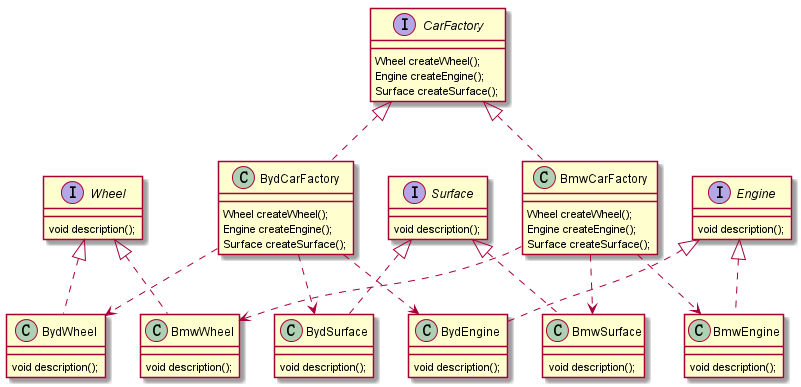

# 3. 设计模式之抽象工厂模式.md

> - 本人昵称: 天之妖星(kco1989/tianshi_kco)
> - 联系邮箱: <kco1989@qq.com>
> - 本文为博主原创文章，未经博主允许不得转载。如需转载,请标明博文原地址.
> - 代码已经全部托管[github](https://github.com/kco1989/examples)有需要的同学自行下载
> - 本人的博客地址如下:
>   - [CSDN](http://blog.csdn.net/tianshi_kco)
>   - [segmentfaul](https://segmentfault.com/u/kco1989)
>   - [博客园](http://www.cnblogs.com/k大co1989/)
>   - [开源中国](https://my.oschina.net/kco1989/blog)
>

# 引言
在开始讲抽象工厂模式之前,我们先理解一下产品族和产品等级的概念.
- 比如说人有`黑种人`,`白种人`,`黄种人`,那么这就是三个`产品族`,每个人有`五官`,`四肢`,`身体`,那么这就是产品等级 <br>

- 比如说`红色`,`黑色`,`黄色`这几个是`产品族`,那么不同的形状如`三角形`,`圆形`,`四边形`这些就是产品等级 <br>

- 比如说`ios`,`android`这几个是`产品族`,那么运行不在通过操作下控件,如`文本框`,`按钮`,`提示框`等这些就是产品等级<br>

- 又比如说今天要说到的例子,`宝马系列`,`比亚迪系列`这是`产品族`,那么汽车的`外观`,`轮子`,`引擎`这些就是产品等级<br>


理解了产品族和产品等级后,我们再来看一下抽象工厂模式的uml图: <br>

通过uml图,我们可以看出,抽象工厂类封装了创建整个产品族的所有产品等级信息的接口.
而不同的具体工厂类则负责创建各自产品族的具体产品等级的产品.

> 这两句话有点饶,大家结合产品族和产品等级,已经uml图好好读几遍,应该可以理解了.

# 汽车制造例子
uml图如下:


## 抽象工厂类 `CarFactory`

```java
public interface CarFactory {

    Wheel createWheel();

    Engine createEngine();

    Surface createSurface();
}
```

> 从代码可以看出,抽象工厂封装了创建汽车产品族的所有产品等级,即汽车外观,汽车引擎,起床轮子

## 宝马制造厂 `BmwCarFactory`

```java
public class BmwCarFactory implements CarFactory {
    @Override
    public Wheel createWheel() {
        return new BmwWheel();
    }

    @Override
    public Engine createEngine() {
        return new BmwEngine();
    }

    @Override
    public Surface createSurface() {
        return new BmwSurface();
    }
}
```
## 比亚迪制造厂 `BydCarFactory`

```java
public class BydCarFactory implements CarFactory {
    @Override
    public Wheel createWheel() {
        return new BydWheel();
    }

    @Override
    public Engine createEngine() {
        return new BydEngine();
    }

    @Override
    public Surface createSurface() {
        return new BydSurface();
    }
}
```

## 产品等级的产品 引擎`Engine`, 外观`Surface`, 轮子`Wheel`

引擎`Engine`
```java
public interface Engine {
    void description();
}
```

外观`Surface`
```java
public interface Surface {
    void description();
}
```

轮子`Wheel`
```java
public interface Wheel {
    void description();
}
```

## 宝马产品族的产品等级的产品  
宝马引擎`BmwEngine`
```java
public class BmwEngine implements Engine{
    @Override
    public void description() {
        System.out.println("制造宝马的引擎"); 
    }
}

```

宝马外观`BmwSurface`
```java
public class BmwSurface implements Surface {
    @Override
    public void description() {
        System.out.println("制造宝马的外观");
    }
}
```

宝马轮子`BmwWheel
```java
public class BmwWheel implements Wheel {
    @Override
    public void description() {
        System.out.println("制造宝马的轮子");
    }
}           
```

## 比亚迪产品族的产品等级的产品  
比亚迪引擎`BydEngine`
```java
public class BydEngine implements Engine {
    @Override
    public void description() {
        System.out.println("制造比亚迪的引擎");
    }
}

```

比亚迪外观`BydSurface`
```java
public class BydSurface implements Surface {
    @Override
    public void description() {
        System.out.println("制造比亚迪的外观");
    }
}
```

比亚迪轮子`BydWheel
```java
public class BydWheel implements Wheel {
    @Override
    public void description() {
        System.out.println("制造比亚迪的轮子");
    }
}        
```

## 测试例子

```java
public class TestMain {
    public static void main(String[] args) {
        CarFactory bmwCarFactory = new BmwCarFactory();
        bmwCarFactory.createEngine().description();
        bmwCarFactory.createSurface().description();
        bmwCarFactory.createWheel().description();
        System.out.println("=========================");
        CarFactory bydCarFactory = new BydCarFactory();
        bydCarFactory.createEngine().description();
        bydCarFactory.createSurface().description();
        bydCarFactory.createWheel().description();
    }
}
```

> 运行结果 <br>
> 制造宝马的引擎 <br>
> 制造宝马的外观 <br>
> 制造宝马的轮子 <br>
> ========================= <br>
> 制造比亚迪的引擎 <br>
> 制造比亚迪的外观 <br>
> 制造比亚迪的轮子 <br>

通过运行结果,我们可以看出`宝马制造厂`不会制造出比亚迪的产品,`比亚迪制造厂`也不会制造出宝马的产品,但是汽车所需要的部件,他们各自都能创建出来.

# 打赏
>如果觉得我的文章写的还过得去的话,有钱就捧个钱场,没钱给我捧个人场(帮我点赞或推荐一下)
>
>
>
