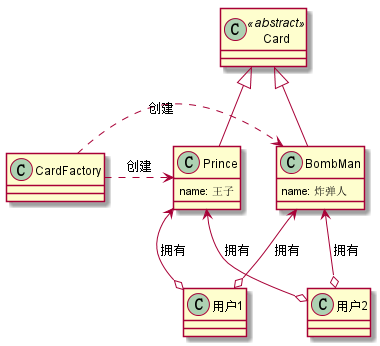

# 6. 设计模式之享元模式.md

> - 本人昵称: 天之妖星(kco1989/tianshi_kco)
> - 联系邮箱: <kco1989@qq.com>
> - 本文为博主原创文章，未经博主允许不得转载。如需转载,请标明博文原地址.
> - 代码已经全部托管[github](https://github.com/kco1989/examples)有需要的同学自行下载
> - 本人的博客地址如下:
>   - [CSDN](http://blog.csdn.net/tianshi_kco)
>   - [segmentfaul](https://segmentfault.com/u/kco1989)
>   - [博客园](http://www.cnblogs.com/k大co1989/)
>   - [开源中国](https://my.oschina.net/kco1989/blog)
>

# 引言
享元模式.就是同享不变的对象.比如在网游中,打怪掉装备.一般吊的装备都不是唯一.
也就是同一件装备,可能有很多玩家拥有.那么这个时候,对每个拥有该装备的玩家各自new出一件装备.
这将浪费大量的内存.这时候,我们就可以用享元模式.让我们看一下享元模式的uml图.<br>


享元模式一般伴随的创建共享对象,所以一般会与工厂模式一起使用.
通过uml图中,我们可以看到`具体产品`是有`享元工厂`创建出来的,而`用户`与`具体产品`的关系是`多对一`的形式.
即多个`用户`通过拥有的`具体产品`是同一个对象.

# 部落战争
这里我们以部落战争这个卡牌游戏为例子.
部落战争是一个卡牌收集游戏.每个卡牌的名字,攻击范围,移动速度等数据一般都是固定不变的.但是卡片的等级却是变化.
卡片的生命值,攻击力是跟卡片的等级所决定.如果不使用享元模式,每个用户对每张卡片都是new出来,这时候后台就造成很多不必要的内存消耗.
这是时候,我们可以采用享元模式.减少不必要的内存消耗.

## uml图



## 开片抽象类 `Card`

```java
public abstract class Card {
    protected String name;          // 卡片名字
    protected int holyWater;        // 消耗的圣水
    protected float attackRange;    // 攻击范围
    protected float attackSpeed;    // 攻击速度
    protected String moveSpeed;      // 移动速度
    protected int waitTime;         // 等待参战时间
    protected String attackTarget;  // 攻击目标

    public Card(String name, int holyWater, float attackRange, float attackSpeed, String moveSpeed, int waitTime, String attackTarget) {
        this.name = name;
        this.holyWater = holyWater;
        this.attackRange = attackRange;
        this.attackSpeed = attackSpeed;
        this.moveSpeed = moveSpeed;
        this.waitTime = waitTime;
        this.attackTarget = attackTarget;
    }

    public String getName() {
        return name;
    }

    public int getHolyWater() {
        return holyWater;
    }

    public float getAttackRange() {
        return attackRange;
    }

    public float getAttackSpeed() {
        return attackSpeed;
    }

    public String getMoveSpeed() {
        return moveSpeed;
    }

    public int getWaitTime() {
        return waitTime;
    }

    public String getAttackTarget() {
        return attackTarget;
    }

    abstract int getHealthPoint(int level);
    abstract int getAttack(int level);
    abstract int getAttackPerSecond(int level);
}
```

# 王子`Prince`
```java
public class Prince extends Card{

    private static final int[] HEALTH_POINT = new int[]{
        1100, 1200, 1331, 1463, 1606, 1760, 1936
    };
    private static final int[] ATTACK = new int[]{
        220, 242, 266, 292, 321, 352, 387
    };
    private static final int[] ATTACK_PER_SECOND = new int[]{
        146, 161, 177, 194, 214, 234, 258
    };
    public Prince() {
        super("王子", 5, 2.5f, 1.5f, "中等", 1, "地面");
    }
    @Override
    int getHealthPoint(int level) {
        if (level <= 0){
            return HEALTH_POINT[0];
        }
        if (level >= HEALTH_POINT.length){
            return HEALTH_POINT[HEALTH_POINT.length - 1];
        }
        return HEALTH_POINT[level];
    }

    @Override
    int getAttack(int level) {
        if (level <= 0){
            return ATTACK[0];
        }
        if (level >= ATTACK.length){
            return ATTACK[ATTACK.length - 1];
        }
        return ATTACK[level];
    }

    @Override
    int getAttackPerSecond(int level) {
        if (level <= 0){
            return ATTACK_PER_SECOND[0];
        }
        if (level >= ATTACK_PER_SECOND.length){
            return ATTACK_PER_SECOND[ATTACK_PER_SECOND.length - 1];
        }
        return ATTACK_PER_SECOND[level];
    }

}
```
## 炸弹人 `BombMan`

```java
public class BombMan extends Card{

    private static final int[] HEALTH_POINT = new int[]{
        150, 165, 181, 199, 219, 240, 264
    };
    private static final int[] ATTACK = new int[]{
        100, 110, 121, 133, 146, 160, 176
    };
    private static final int[] ATTACK_PER_SECOND = new int[]{
        50, 55, 60, 66, 73, 80, 88
    };
    public BombMan() {
        super("炸弹人", 3, 5f, 2f, "中等", 1, "地面");
    }
    @Override
    int getHealthPoint(int level) {
        if (level <= 0){
            return HEALTH_POINT[0];
        }
        if (level >= HEALTH_POINT.length){
            return HEALTH_POINT[HEALTH_POINT.length - 1];
        }
        return HEALTH_POINT[level];
    }

    @Override
    int getAttack(int level) {
        if (level <= 0){
            return ATTACK[0];
        }
        if (level >= ATTACK.length){
            return ATTACK[ATTACK.length - 1];
        }
        return ATTACK[level];
    }

    @Override
    int getAttackPerSecond(int level) {
        if (level <= 0){
            return ATTACK_PER_SECOND[0];
        }
        if (level >= ATTACK_PER_SECOND.length){
            return ATTACK_PER_SECOND[ATTACK_PER_SECOND.length - 1];
        }
        return ATTACK_PER_SECOND[level];
    }
}
```

## 开片类型 `CardType`

```java
public enum CardType {
    Prince,BombMan
}
```

## 享元工厂 `CardFactory`

```java
public class CardFactory {
    public static final Map<CardType, Card> cardMap = new HashMap<>();
    public static Card createCard(CardType type){
        Card card = cardMap.get(type);
        if (card != null){
            return card;
        }
        switch (type){
            case BombMan:
                card = new BombMan();
                break;
            case Prince:
                card = new Prince();
                break;
            default:
                throw new RuntimeException("never go here");
        }
        cardMap.put(type, card);
        return card;
    }
}
```

## 用户数据 `UserData`

```java
public class UserData {
    private Card prince;
    private int princeLevel;
    private Card bombMan;
    private int bombManLevel;

    public void addPrinceCard( int level){
        if (prince == null){
            prince = CardFactory.createCard(CardType.Prince);
        }
        princeLevel = Math.max(level, princeLevel);
    }
    public void addBombManCard(int level){
        if (bombMan == null){
            bombMan = CardFactory.createCard(CardType.BombMan);
        }
        bombManLevel = Math.max(level, bombManLevel);
    }

    @Override
    public String toString() {
        StringBuilder sb = new StringBuilder();
        sb.append("=========卡片信息========== \n");
        if (prince != null){
            sb.append("\t名称: " + prince.getName())
                    .append("\t圣水:" + prince.getHolyWater())
                    .append("\t工具目标:" + prince.getAttackTarget())
                    .append("\t移动速度:" + prince.getMoveSpeed())
                    .append("\t攻击速度:" + prince.getAttackSpeed())
                    .append("\t生命值:" + prince.getHealthPoint(princeLevel))
                    .append("\t攻击力:" + prince.getAttack(princeLevel))
                    .append("\t每秒攻击力:" + prince.getAttackPerSecond(princeLevel) + "\n");
        }
        if (bombMan != null){
            sb.append("\t名称: " + bombMan.getName())
                    .append("\t圣水:" + bombMan.getHolyWater())
                    .append("\t工具目标:" + bombMan.getAttackTarget())
                    .append("\t移动速度:" + bombMan.getMoveSpeed())
                    .append("\t攻击速度:" + bombMan.getAttackSpeed())
                    .append("\t生命值:" + bombMan.getHealthPoint(bombManLevel))
                    .append("\t攻击力:" + bombMan.getAttack(bombManLevel))
                    .append("\t每秒攻击力:" + bombMan.getAttackPerSecond(bombManLevel) + "\n");
        }
        return sb.toString();
    }

    public Card getPrince() {
        return prince;
    }

    public Card getBombMan() {
        return bombMan;
    }
}
```

## 测试类

```java
public class TestMain {
    public static void main(String[] args) {
        List<UserData> userDatas = new ArrayList<>();
        Random random = new Random();
        for (int i = 0; i < 10; i ++){
            UserData userData = new UserData();
            userData.addPrinceCard(random.nextInt(7));
            userData.addBombManCard(random.nextInt(7));
            userDatas.add(userData);
        }
        for (UserData userData : userDatas){
            System.out.println(userData);
        }

        System.out.println("校验每个用户的卡牌信息是否共享的..");
        for (int i = 0; i < 9; i ++){
            int index1 = i;
            int index2 = i + 1;
            System.out.println("玩家 " + index1 +
                    " 与玩家 " + index2 +
                    " 的王子是否为同一个:" +
                    (userDatas.get(index1).getPrince() == userDatas.get(index2).getPrince()));
            System.out.println("玩家 " + index1 +
                    " 与玩家 " + index2 +
                    " 的炸弹人是否为同一个:" +
                    (userDatas.get(index1).getBombMan() == userDatas.get(index2).getBombMan()));
        }
    }
}
```

> 运行结果: <br>
> =========卡片信息========== <br>
> 	名称: 王子	圣水:5	工具目标:地面	移动速度:中等	攻击速度:1.5	生命值:1200	攻击力:242	每秒攻击力:161<br>
> 	名称: 炸弹人	圣水:3	工具目标:地面	移动速度:中等	攻击速度:2.0	生命值:199	攻击力:133	每秒攻击力:66<br>
> <br>
> =========卡片信息========== <br>
> 	名称: 王子	圣水:5	工具目标:地面	移动速度:中等	攻击速度:1.5	生命值:1100	攻击力:220	每秒攻击力:146<br>
> 	名称: 炸弹人	圣水:3	工具目标:地面	移动速度:中等	攻击速度:2.0	生命值:150	攻击力:100	每秒攻击力:50<br>
> <br>
> =========卡片信息========== <br>
> 	名称: 王子	圣水:5	工具目标:地面	移动速度:中等	攻击速度:1.5	生命值:1463	攻击力:292	每秒攻击力:194<br>
> 	名称: 炸弹人	圣水:3	工具目标:地面	移动速度:中等	攻击速度:2.0	生命值:165	攻击力:110	每秒攻击力:55<br>
> <br>
> =========卡片信息========== <br>
> 	名称: 王子	圣水:5	工具目标:地面	移动速度:中等	攻击速度:1.5	生命值:1606	攻击力:321	每秒攻击力:214<br>
> 	名称: 炸弹人	圣水:3	工具目标:地面	移动速度:中等	攻击速度:2.0	生命值:240	攻击力:160	每秒攻击力:80<br>
> <br>
> =========卡片信息========== <br>
> 	名称: 王子	圣水:5	工具目标:地面	移动速度:中等	攻击速度:1.5	生命值:1936	攻击力:387	每秒攻击力:258<br>
> 	名称: 炸弹人	圣水:3	工具目标:地面	移动速度:中等	攻击速度:2.0	生命值:264	攻击力:176	每秒攻击力:88<br>
> <br>
> =========卡片信息========== <br>
> 	名称: 王子	圣水:5	工具目标:地面	移动速度:中等	攻击速度:1.5	生命值:1606	攻击力:321	每秒攻击力:214<br>
> 	名称: 炸弹人	圣水:3	工具目标:地面	移动速度:中等	攻击速度:2.0	生命值:264	攻击力:176	每秒攻击力:88<br>
> <br>
> =========卡片信息========== <br>
> 	名称: 王子	圣水:5	工具目标:地面	移动速度:中等	攻击速度:1.5	生命值:1760	攻击力:352	每秒攻击力:234<br>
> 	名称: 炸弹人	圣水:3	工具目标:地面	移动速度:中等	攻击速度:2.0	生命值:165	攻击力:110	每秒攻击力:55<br>
> <br>
> =========卡片信息========== <br>
> 	名称: 王子	圣水:5	工具目标:地面	移动速度:中等	攻击速度:1.5	生命值:1760	攻击力:352	每秒攻击力:234<br>
> 	名称: 炸弹人	圣水:3	工具目标:地面	移动速度:中等	攻击速度:2.0	生命值:181	攻击力:121	每秒攻击力:60<br>
> <br>
> =========卡片信息========== <br>
> 	名称: 王子	圣水:5	工具目标:地面	移动速度:中等	攻击速度:1.5	生命值:1463	攻击力:292	每秒攻击力:194<br>
> 	名称: 炸弹人	圣水:3	工具目标:地面	移动速度:中等	攻击速度:2.0	生命值:165	攻击力:110	每秒攻击力:55<br>
> <br>
> =========卡片信息========== <br>
> 	名称: 王子	圣水:5	工具目标:地面	移动速度:中等	攻击速度:1.5	生命值:1100	攻击力:220	每秒攻击力:146<br>
> 	名称: 炸弹人	圣水:3	工具目标:地面	移动速度:中等	攻击速度:2.0	生命值:199	攻击力:133	每秒攻击力:66<br>
> <br>
> 校验每个用户的卡牌信息是否共享的..<br>
> 玩家 0 与玩家 1 的王子是否为同一个:true<br>
> 玩家 0 与玩家 1 的炸弹人是否为同一个:true<br>
> 玩家 1 与玩家 2 的王子是否为同一个:true<br>
> 玩家 1 与玩家 2 的炸弹人是否为同一个:true<br>
> 玩家 2 与玩家 3 的王子是否为同一个:true<br>
> 玩家 2 与玩家 3 的炸弹人是否为同一个:true<br>
> 玩家 3 与玩家 4 的王子是否为同一个:true<br>
> 玩家 3 与玩家 4 的炸弹人是否为同一个:true<br>
> 玩家 4 与玩家 5 的王子是否为同一个:true<br>
> 玩家 4 与玩家 5 的炸弹人是否为同一个:true<br>
> 玩家 5 与玩家 6 的王子是否为同一个:true<br>
> 玩家 5 与玩家 6 的炸弹人是否为同一个:true<br>
> 玩家 6 与玩家 7 的王子是否为同一个:true<br>
> 玩家 6 与玩家 7 的炸弹人是否为同一个:true<br>
> 玩家 7 与玩家 8 的王子是否为同一个:true<br>
> 玩家 7 与玩家 8 的炸弹人是否为同一个:true<br>
> 玩家 8 与玩家 9 的王子是否为同一个:true<br>
> 玩家 8 与玩家 9 的炸弹人是否为同一个:true<br>
>> 通过运行结果,我们可以看到每个玩家的王子和炸弹人都分别是同一个共享对象,但是各自的数据却有所不同

# 打赏
>如果觉得我的文章写的还过得去的话,有钱就捧个钱场,没钱给我捧个人场(帮我点赞或推荐一下)
>
>
>
