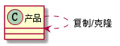
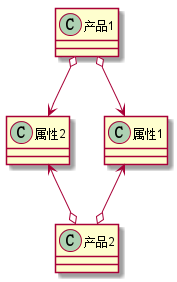

# 6. 设计模式之原形模式.md

> - 本人昵称: 天之妖星(kco1989/tianshi_kco)
> - 联系邮箱: <kco1989@qq.com>
> - 本文为博主原创文章，未经博主允许不得转载。如需转载,请标明博文原地址.
> - 代码已经全部托管[github](https://github.com/kco1989/examples)有需要的同学自行下载
> - 本人的博客地址如下:
>   - [CSDN](http://blog.csdn.net/tianshi_kco)
>   - [segmentfaul](https://segmentfault.com/u/kco1989)
>   - [博客园](http://www.cnblogs.com/k大co1989/)
>   - [开源中国](https://my.oschina.net/kco1989/blog)
>

# 引言
原形模式通俗来说,就是我们经常用的复制,黏贴.也就是说是一个复制对象的能力.如uml图<br>


要使一个对象拥有自我复制能力的话,一般使用`Object.clone()`,要是用`Object.clone()`,则该类必须实现接口`Cloneable`
如果在`clone`方法的实现为`super.clone()`,则是浅复制.

# 浅复制
`浅复制`指的是在复制的时候,对引用类型只复制引用地址而已.即复制后的对象和复制前的对象共同拥有同一个属性对象.如uml<br>


## 例子

```java
public class Demo1 implements Cloneable{
    private String name;
    private int age;
    private List<String> list;

    public String getName() {
        return name;
    }

    public void setName(String name) {
        this.name = name;
    }

    public int getAge() {
        return age;
    }

    public void setAge(int age) {
        this.age = age;
    }

    public List<String> getList() {
        return list;
    }

    public void setList(List<String> list) {
        this.list = list;
    }

    @Override
    protected Object clone() throws CloneNotSupportedException {
        return super.clone();
    }

    @Override
    public String toString() {
        return "Demo1{" +
                "name='" + name + '\'' +
                ", age=" + age +
                ", list=" + list +
                '}';
    }

    public static void main(String[] args) throws CloneNotSupportedException {
        Demo1 demo1 = new Demo1();
        demo1.setAge(20);
        demo1.setName("张三");
        List<String> list = new ArrayList<>();
        list.add("Cat");
        list.add("Dot");
        demo1.setList(list);
        Demo1 clone = (Demo1)demo1.clone();
        System.out.println("是否为同一个对象:" + (demo1 == clone));
        System.out.println(demo1);
        System.out.println(clone);
        System.out.println("clone对象的list增加Pig元素后");
        clone.getList().add("Pig");
        System.out.println(demo1);
        System.out.println(clone);
    }
}
```

> 运行结果:<br/>
> 是否为同一个对象:false<br/>
> Demo1{name='张三', age=20, list=[Cat, Dot]}<br/>
> Demo1{name='张三', age=20, list=[Cat, Dot]}<br/>
> clone对象的list增加Pig元素后<br/>
> Demo1{name='张三', age=20, list=[Cat, Dot, Pig]}<br/>
> Demo1{name='张三', age=20, list=[Cat, Dot, Pig]}<br/>

可以看出,复制后的list是同一个对象

# 深复制
深复制一般把对象序列化后,再范序列号就能得到两个完全不关联的对象.

## 例子1

```java
public class Demo2 implements Cloneable, Serializable{
    private String name;
    private int age;
    private List<String> list;

    public String getName() {
        return name;
    }

    public void setName(String name) {
        this.name = name;
    }

    public int getAge() {
        return age;
    }

    public void setAge(int age) {
        this.age = age;
    }

    public List<String> getList() {
        return list;
    }

    public void setList(List<String> list) {
        this.list = list;
    }

    @Override
    protected Object clone() throws CloneNotSupportedException {
        try {
            PipedInputStream pis = new PipedInputStream();
            PipedOutputStream pos = new PipedOutputStream(pis);

            ObjectOutputStream oos = new ObjectOutputStream(pos);
            oos.writeObject(this);
            oos.flush();
            oos.close();

            ObjectInputStream ois = new ObjectInputStream(pis);
            Object o = ois.readObject();
            ois.close();
            return o;
        } catch (IOException e) {
            e.printStackTrace();
        } catch (ClassNotFoundException e) {
            e.printStackTrace();
        }
        return null;
    }

    @Override
    public String toString() {
        return "Demo1{" +
                "name='" + name + '\'' +
                ", age=" + age +
                ", list=" + list +
                '}';
    }

    public static void main(String[] args) throws CloneNotSupportedException {
        Demo2 demo2 = new Demo2();
        demo2.setAge(20);
        demo2.setName("张三");
        List<String> list = new ArrayList<>();
        list.add("Cat");
        list.add("Dot");
        demo2.setList(list);
        Demo2 clone = (Demo2)demo2.clone();
        System.out.println("是否为同一个对象:" + (demo2 == clone));
        System.out.println(demo2);
        System.out.println(clone);
        clone.getList().add("Pig");
        System.out.println("clone对象的list增加Pig元素后");
        System.out.println(demo2);
        System.out.println(clone);
    }
}
```

> 运行结果:<br/>
> 是否为同一个对象:false<br/>
> Demo1{name='张三', age=20, list=[Cat, Dot]}<br/>
> Demo1{name='张三', age=20, list=[Cat, Dot]}<br/>
> clone对象的list增加Pig元素后<br/>
> Demo1{name='张三', age=20, list=[Cat, Dot]}<br/>
> Demo1{name='张三', age=20, list=[Cat, Dot, Pig]}<br/>

可以看出两个对象的list现在不是同一个对象.使用java自带的序列化工具时,对象记得要实现接口`Serializable`

## 例子2
使用其他序列号工具

```java
public class Demo3 implements Cloneable{
    private String name;
    private int age;
    private List<String> list;

    public String getName() {
        return name;
    }

    public void setName(String name) {
        this.name = name;
    }

    public int getAge() {
        return age;
    }

    public void setAge(int age) {
        this.age = age;
    }

    public List<String> getList() {
        return list;
    }

    public void setList(List<String> list) {
        this.list = list;
    }

    @Override
    protected Object clone() throws CloneNotSupportedException {
        Gson gson = new Gson();
        return gson.fromJson(gson.toJson(this), Demo3.class);
    }

    @Override
    public String toString() {
        return "Demo1{" +
                "name='" + name + '\'' +
                ", age=" + age +
                ", list=" + list +
                '}';
    }

    public static void main(String[] args) throws CloneNotSupportedException {
        Demo3 demo3 = new Demo3();
        demo3.setAge(20);
        demo3.setName("张三");
        List<String> list = new ArrayList<>();
        list.add("Cat");
        list.add("Dot");
        demo3.setList(list);
        Demo3 clone = (Demo3)demo3.clone();
        System.out.println("是否为同一个对象:" + (demo3 == clone));
        System.out.println(demo3);
        System.out.println(clone);
        clone.getList().add("Pig");
        System.out.println("clone对象的list增加Pig元素后");
        System.out.println(demo3);
        System.out.println(clone);
    }
}
```

> 运行结果<br/>
> 是否为同一个对象:false<br/>
> Demo1{name='张三', age=20, list=[Cat, Dot]}<br/>
> Demo1{name='张三', age=20, list=[Cat, Dot]}<br/>
> clone对象的list增加Pig元素后<br/>
> Demo1{name='张三', age=20, list=[Cat, Dot]}<br/>
> Demo1{name='张三', age=20, list=[Cat, Dot, Pig]}<br/>


# 打赏
>如果觉得我的文章写的还过得去的话,有钱就捧个钱场,没钱给我捧个人场(帮我点赞或推荐一下)
>
>
>
