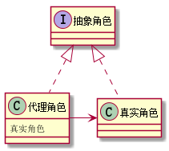

# 11. 设计模式之代理模式.md

> - 本人昵称: 天之妖星(kco1989/tianshi_kco)
> - 联系邮箱: <kco1989@qq.com>
> - 本文为博主原创文章，未经博主允许不得转载。如需转载,请标明博文原地址.
> - 代码已经全部托管[github](https://github.com/kco1989/examples)有需要的同学自行下载
> - 本人的博客地址如下:
>   - [CSDN](http://blog.csdn.net/tianshi_kco)
>   - [segmentfaul](https://segmentfault.com/u/kco1989)
>   - [博客园](http://www.cnblogs.com/k大co1989/)
>   - [开源中国](https://my.oschina.net/kco1989/blog)
>

# 引言
代理模式涉及一下几个角色
- 抽象角色：通过接口或抽象类声明真实角色实现的业务方法。
- 代理角色：实现抽象角色，是真实角色的代理，通过真实角色的业务逻辑方法来实现抽象方法，并可以附加自己的操作。
- 真实角色：实现抽象角色，定义真实角色所要实现的业务逻辑，供代理角色调用。



# 潘金莲与王婆
读过水浒传的人都知道潘金莲和西门庆的故事.中间如果没有王婆这个代理.那么也就没有了这段故事.
当然王婆仅仅是潘金莲的代理而已,与西门庆嘿嘿嘿的实际上还是潘金莲,如果换做西门庆和王婆嘿嘿嘿的,
那么西门庆怕是想死的心都有了.

## 抽象角色: `Woman` 女人

```java
public interface Woman {
    void heiheihei();
}
```

## 具体角色: `PanjinLian` 潘金莲

```java
public class PanjinLian implements Woman {
    @Override
    public void heiheihei() {
        System.out.println("潘金莲在嘿嘿嘿....");
    }

    @Override
    public String toString() {
        return "潘金莲";
    }
}
```

## 代理角色 `WangPo` 王婆

```java
public class WangPo implements Woman {
    private Woman woman;
    public WangPo(Woman woman) {
        this.woman = woman;
    }

    @Override
    public void heiheihei() {
        System.out.println("王婆找来 " + woman);
        woman.heiheihei();
        System.out.println("王婆送走 " + woman);
    }
}

```

## 西门庆 `XimenQing`

```java
public class XimenQing {
    public static void main(String[] args) {
        WangPo wangPo = new WangPo(new PanjinLian());
        wangPo.heiheihei();
    }
}
```

> - 运行结果:
> - 王婆找来 潘金莲
> - 潘金莲在嘿嘿嘿....
> - 王婆送走 潘金莲

没毛病,西门庆是和潘金莲在嘿嘿嘿,而不是跟王婆.

# 打赏
>如果觉得我的文章写的还过得去的话,有钱就捧个钱场,没钱给我捧个人场(帮我点赞或推荐一下)
>
>
>
