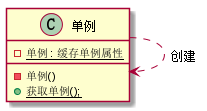

# 3. 设计模式之抽象工厂模式.md

> - 本人昵称: 天之妖星(kco1989/tianshi_kco)
> - 联系邮箱: <kco1989@qq.com>
> - 本文为博主原创文章，未经博主允许不得转载。如需转载,请标明博文原地址.
> - 代码已经全部托管[github](https://github.com/kco1989/examples)有需要的同学自行下载
> - 本人的博客地址如下:
>   - [CSDN](http://blog.csdn.net/tianshi_kco)
>   - [segmentfaul](https://segmentfault.com/u/kco1989)
>   - [博客园](http://www.cnblogs.com/k大co1989/)
>   - [开源中国](https://my.oschina.net/kco1989/blog)
>

# 引言
单例模式是比较简单的设计模式.就涉及一个类而已. <br>

创建单例模式需要注意一下几点:
1. 构造器要私有化.确保不被子类继承,也不被外部代码创建
2. 提供一个静态方法获取单例对象

# 饿汉模式  

```java
public class Singleton1 {
    private Singleton1(){}
    private static Singleton1 singleton1;
    public static synchronized Singleton1 getInstance(){
        if (singleton1 == null){
            singleton1 = new Singleton1();
        }
        return singleton1;
    }
}
```

饿汉模式是在类被加载的时候不主动创建单例对象,但需要的该单例对象的时候才创建.为了确保多线程安全需要在方法体上加`synchronized`关键字,确保多线程安全.
但是也正因为如此,所以导致该实现的效率比较低下.因为在99%的情况不需要同步了,只需要直接获取已经创建的对象就行了.
结果在单例对象被创建出来后,多线程在获取单例对象时,都要在等其他线程释放`Singleton1.class`锁后才能获取到该单例对象.

# 双重校验法
```java
public class Singleton2 {
    private Singleton2(){}
    private static Singleton2 singleton2;
    public static Singleton2 getInstance(){
        if (singleton2 == null){
            synchronized (Singleton2.class){
                if (singleton2 == null){
                    singleton2 = new Singleton2();
                }
            }
        }
        return singleton2;
    }
}
```

双重校验法,解决饿汉模式的效率问题.但是无疑给代码的增加了复杂度.

# 饱汉模式

```java
public class Singleton3 {
    private Singleton3(){}
    private static Singleton3 singleton2 = new Singleton3();
    public static Singleton3 getInstance(){
        return singleton2;
    }
}
```

包含模式最简单,不需要考虑多线程的问题,因为在类被加载的时候,就已经创建出一个单例对象了.
但是也因为如此,不管代码是否需要使用到这个单例对象,内存都需要为该单例对象提供对应开销.

# 打赏
>如果觉得我的文章写的还过得去的话,有钱就捧个钱场,没钱给我捧个人场(帮我点赞或推荐一下)
>
>
>
