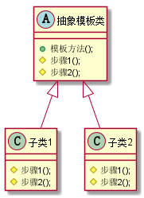
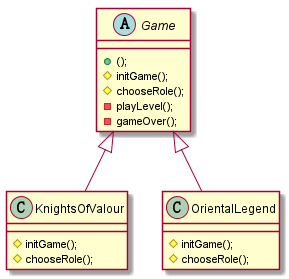

# 15. 设计模式之模板方法模式.md

> - 本人昵称: 天之妖星(kco1989/tianshi_kco)
> - 联系邮箱: <kco1989@qq.com>
> - 本文为博主原创文章，未经博主允许不得转载。如需转载,请标明博文原地址.
> - 代码已经全部托管[github](https://github.com/kco1989/examples)有需要的同学自行下载
> - 本人的博客地址如下:
>   - [CSDN](http://blog.csdn.net/tianshi_kco)
>   - [segmentfaul](https://segmentfault.com/u/kco1989)
>   - [博客园](http://www.cnblogs.com/k大co1989/)
>   - [开源中国](https://my.oschina.net/kco1989/blog)
>

# 引言
定义一个框架的骨架,将整个流程定义好.但具体操作则推迟到子类去完成.是模板子类在不改变整个流程框架的,而去实现特定的操作步骤.


比如,我们如果要去旅游,一般都是分以下几个步骤的
1. 找相应的旅游攻略
2. 选择跟团或者各人游
3. 出游
4. 返回

整个流程的骨架就已经定好了,然后每个人根据自己实际情况,可能会有说不一样,但是整个流程基本是一致的.

## 闯关游戏
相信大家小时候都玩过街机游戏,这里就以街机闯关游戏为例子



大部分街机闯关类游戏的步骤都是一样,
1. 载入游戏
2. 选择角色
3. 开始游戏的某一个关卡
4. 角色挂了或则闯完全部关卡,则游戏结束,否则继续步骤3

### 游戏骨架: `Game`

```java
public abstract class Game {

    private String[] levelName;
    private Random random = new Random();
    public void play(){
        levelName = getLevelName();
        initGame();
        chooseRole();
        int level = 0;
        do{
            playLevel(level);
            level ++;
        }while (!gameOver(level));
    }

    private void playLevel(int level){
        System.out.println("开始关卡 --> " + levelName[level]);
    }

    private boolean gameOver(int level){
        if (levelName == null || level >= levelName.length){
            System.out.println("恭喜你,通关了.");
            return true;
        }
        if (random.nextInt(100) >= 90){
            System.out.println("抱歉,你已经挂了....");
            return true;
        }
        return false;
    }

    protected abstract void chooseRole();

    protected abstract void initGame();

    protected abstract String[] getLevelName() ;
}
```

### 三国战记 `KnightsOfValour`

```java
public class KnightsOfValour extends Game{
    private static String[] levelName = {
            "截江救阿斗",
            "定军斩夏侯",
            "威震汉中池",
            "大意失荆州",
            "智破八阵图",
            "雪战夺荆州",
            "三国归一统"
    };
    private static Random random = new Random();

    @Override
    protected void chooseRole() {
        System.out.println("选择诸葛亮...");
    }

    @Override
    protected void initGame() {
        System.out.println("载入三国战机.....");
    }

    @Override
    protected String[] getLevelName() {
        return levelName;
    }
}

```

### 西游释厄传 `OrientalLegend`

```java
public class OrientalLegend extends Game {
    private static String[] levelName = {
            "平顶山——莲花洞",
            "枯松涧——火云洞",
            "车迟国——智渊寺",
            "通天河——水鱼之家",
            "盘丝岭——盘丝洞",
            "狮驼岭——狮驼洞",
            "火焰山——芭蕉洞"
    };
    @Override
    protected void chooseRole() {
        System.out.println("选择孙悟空...");
    }

    @Override
    protected void initGame() {
        System.out.println("载入西游释厄传....");
    }

    @Override
    protected String[] getLevelName() {
        return levelName;
    }
}
```

### 测试类
```java
public class TestMain {
    public static void main(String[] args) {
        Game game = new KnightsOfValour();
        game.play();
        System.out.println("===============");
        Game game1 = new OrientalLegend();
        game1.play();
    }
}
```

运行结果:

```
载入三国战机.....
选择诸葛亮...
开始关卡 --> 截江救阿斗
开始关卡 --> 定军斩夏侯
开始关卡 --> 威震汉中池
开始关卡 --> 大意失荆州
开始关卡 --> 智破八阵图
开始关卡 --> 雪战夺荆州
开始关卡 --> 三国归一统
恭喜你,通关了.
载入西游释厄传....
选择孙悟空...
开始关卡 --> 平顶山——莲花洞
开始关卡 --> 枯松涧——火云洞
开始关卡 --> 车迟国——智渊寺
开始关卡 --> 通天河——水鱼之家
开始关卡 --> 盘丝岭——盘丝洞
开始关卡 --> 狮驼岭——狮驼洞
开始关卡 --> 火焰山——芭蕉洞
恭喜你,通关了.
```

# 打赏
>如果觉得我的文章写的还过得去的话,有钱就捧个钱场,没钱给我捧个人场(帮我点赞或推荐一下)
>
>
>
